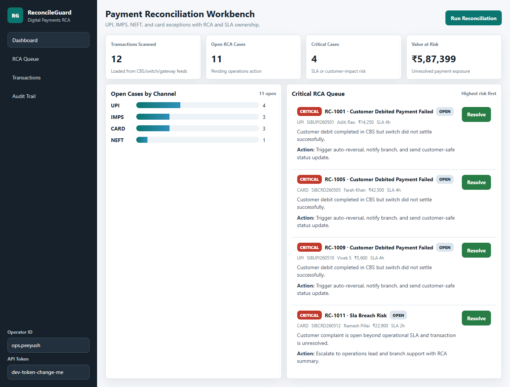

# ReconPilot

> Payments reconciliation and RCA workspace for banking operations teams.

[](.github/workflows/ci.yml)


ReconPilot helps ops teams investigate failed or delayed UPI, IMPS, NEFT, and card transactions without manually comparing CBS, switch, gateway, and complaint records.

## Table of Contents
- [Visual Tour](#visual-tour)
- [Features](#features)
- [Tech Stack](#tech-stack)
- [Installation](#installation)
- [Usage](#usage)
- [API](#api)
- [Deployment](#deployment)
- [Contributing](#contributing)
- [Troubleshooting](#troubleshooting)
- [License and Credits](#license-and-credits)

## Visual Tour
<p align="center">
  
</p>
<p align="center">
  
</p>

## Features
- Automated exception detection for debit-success mismatches, gateway timeouts, duplicate UTRs, and SLA risk.
- RCA queue with severity, recommended action, ownership, and resolution notes.
- Secure auth with sign-up, email verification, password reset, bcrypt hashing, JWT, and RBAC.
- Audit-ready workflow with operator attribution, request IDs, rate limiting, health checks, and CI.

## Tech Stack
- Backend: Java 21, Spring Boot 3, Spring Security, JPA, Flyway.
- Frontend: React, TypeScript, Vite, React Router.
- Data: H2 for local use, PostgreSQL/Oracle-ready runtime support.
- Ops: Docker, Render blueprint, GitHub Actions.

## Installation
**Prerequisites:** Java 21, Maven 3.9+, Node.js 20+ for local UI work, Docker optional.

```powershell
mvn spring-boot:run
```

Open `http://localhost:8080`, then use `/signup`, `/verify`, and `/signin`.

For containers:

```powershell
docker compose up --build
```

## Usage
Example sign-up:

```bash
curl -X POST http://localhost:8080/api/auth/signup \
  -H "Content-Type: application/json" \
  -d '{"fullName":"Demo User","email":"demo@company.com","password":"StrongPass1!","acceptTerms":true}'
```

Important config: `RG_DB_URL`, `RG_DB_USERNAME`, `RG_DB_PASSWORD`, `RG_DB_DRIVER`, `RG_JWT_SECRET`, `RG_EXPOSE_VERIFICATION_TOKEN`, `RG_RATE_LIMIT_PER_MINUTE`.

## API
| Method | Endpoint | Purpose |
|---|---|---|
| POST | `/api/auth/signup` | Register user |
| GET | `/api/auth/verify` | Verify email |
| POST | `/api/auth/login` | Return JWT |
| GET | `/api/summary` | Dashboard KPIs |
| GET | `/api/transactions` | Filter transaction feed |
| GET | `/api/cases` | RCA queue |
| POST | `/api/reconcile/run` | Execute reconciliation |

Protected requests use `Authorization: Bearer <JWT>`.

## Deployment
- Free: [Render](https://render.com/) using `render.yaml`.
- Local/portable: `docker compose up --build`.
- Production: set `RG_EXPOSE_VERIFICATION_TOKEN=false`, store secrets outside source control, and connect to Postgres or Oracle.

## Contributing
1. Fork the repo and create a feature branch.
2. Run `mvn test` and `cd ui && npm test` before opening a PR.
3. Keep API, UI, and docs changes aligned.

## Troubleshooting
- Large Git file warning: remove `ui/node/` from Git tracking and keep it ignored.
- UI auth loop: clear local storage and sign in again.
- Slow free deployment: Render free services sleep after inactivity.
- Missing verification email: set `RG_EXPOSE_VERIFICATION_TOKEN=true` for local testing only.

## License and Credits
No `LICENSE` file is currently committed. Add one before public redistribution.

Credits: badges via [Shields.io](https://shields.io/), deployment docs via [Render](https://render.com/), and project UI assets from repository files in `ui/public/` and `docs/`.
